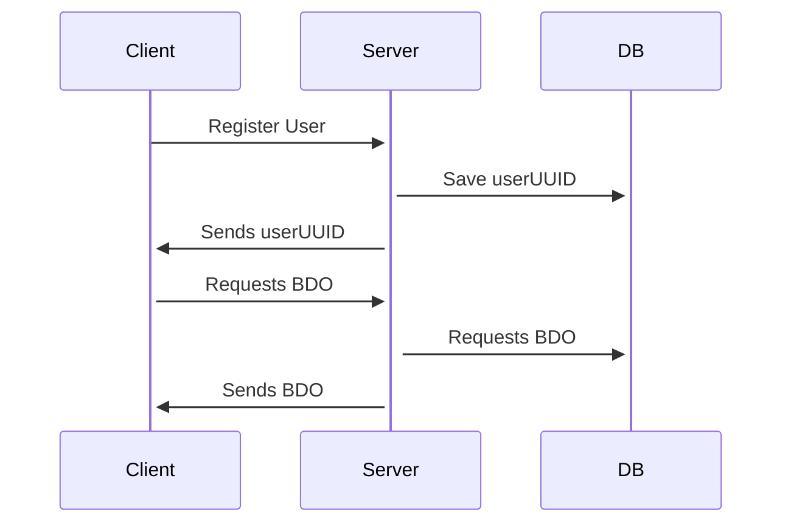
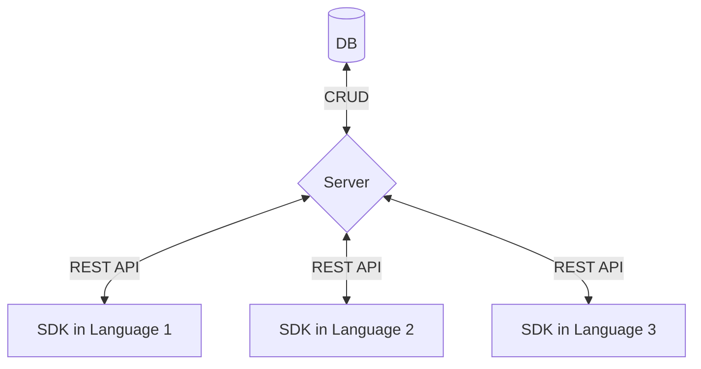

# BDO

*BDO* (short for [Big Dumb Object][bdo]) utilizes the [Sessionless][sessionless] protocol to provide developers with a place to store, well, big dumb objects[^1]. 
It maps the BDO to a public key, so you can sign the BDO so that clients can verify the object they retrieve.

## Overview

BDO is composed of a CRUD server and database pair, and companion client-side libraries.
This repo defines the contract between client and server via REST API, provides database implementation(s) for storing the models used in that contract, and the methods necessary in a client implementation.

The typical usage will look something like:



And here's what the architecture looks like:



## API

It doesn't get much CRUDier than this API:

<details>
 <summary><code>POST</code> <code><b>/user/create</b></code> <code>Creates a new user if pubKey does not exist, and returns existing uuid if it does.
signature message is: timestamp + pubKey + hash</code></summary>

##### Parameters

> | name         |  required     | data type               | description                                                           |
> |--------------|-----------|-------------------------|-----------------------------------------------------------------------|
> | pubKey    |  true     | string (hex)            | the publicKey of the user's keypair  |
> | timestamp    |  true     | string                  | in a production system timestamps prevent replay attacks  |
> | hash         |  true     | string                  | the state hash to save for the user
> | signature    |  true     | string (signature)      | the signature from sessionless for the message  |


##### Responses

> | http code     | content-type                      | response                                                            |
> |---------------|-----------------------------------|---------------------------------------------------------------------|
> | `200`         | `application/json`                | `{"userUUID": <uuid>}`   |
> | `400`         | `application/json`                | `{"code":"400","message":"Bad Request"}`                            |

##### Example cURL

> ```javascript
>  curl -X PUT -H "Content-Type: application/json" -d '{"pubKey": "key", "timestamp": "now", "signature": "sig"}' https://bdo.planetnine.app/user/create
> ```

</details>

<details>
  <summary><code>PUT</code> <code><b>/user/:uuid/bdo</b></code> <code>Puts a user's bdo. If public is true, and pubKey is sent, it will make the BDO available to anyone who queries for that public key.
signature message is:  timestamp + userUUID + hash</code></summary>

##### Parameters

> | name         |  required     | data type               | description                                                           |
> |--------------|-----------|-------------------------|-----------------------------------------------------------------------|
> | timestamp    |  true     | string                  | in a production system timestamps prevent replay attacks  |
> | userUUID     |  true     | string                  | the user's uuid
> | hash         |  true     | string                  | the old hash to replace
> | bdo          |  true     | object                  | the bdo to save
> | public       |  false    | bool                    | whether the bdo should be publicly availbale
> | pubKey       |  false    | string                  | the user's pubKey to map to the bdo
> | signature    |  true     | string (signature)      | the signature from sessionless for the message  |


##### Responses

> | http code     | content-type                      | response                                                            |
> |---------------|-----------------------------------|---------------------------------------------------------------------|
> | `200`         | `application/json`                | `<bdoerences>`   |
> | `400`         | `application/json`                | `{"code":"400","message":"Bad Request"}`                            |

##### Example cURL

> ```javascript
>  curl -X POST -H "Content-Type: application/json" -d '{"timestamp": "right now", "userUUID": "uuid", "hash": "hash", "bdoerences": {"foo": "bar"}, "signature": "signature"}' https://bdo.planetnine.app/user/update-hash
> ```

</details>

<details>
 <summary><code>GET</code> <code><b>/user/:uuid/bdo?timestamp=<timestamp>&hash=<hash>&signature=<signature of (timestamp + uuid + hash)></b></code> <code>Gets the user's bdo, or a pubKey's bdo.</code></summary>

##### Parameters

> | name         |  required     | data type               | description                                                           |
> |--------------|-----------|-------------------------|-----------------------------------------------------------------------|
> | timestamp    |  true     | string                  | in a production system timestamps prevent replay attacks  |
> | hash         |  true     | string                  | the state hash saved client side
> | pubKeyForBDO |  false    | string                  | the pubKey that the BDO maps to
> | signature    |  true     | string (signature)      | the signature from sessionless for the message  |


##### Responses

> | http code     | content-type                      | response                                                            |
> |---------------|-----------------------------------|---------------------------------------------------------------------|
> | `200`         | `application/json`                | `{"bdo": <bdo>}`   |
> | `406`         | `application/json`                | `{"code":"406","message":"Not acceptable"}`                            |

##### Example cURL

> ```javascript
>  curl -X GET -H "Content-Type: application/json" https://bdo.planetnine.app/user/<uuid>?timestamp=123&hash=hash&pubKey=pubKey&signature=signature 
> ```

</details>

<details>
  <summary><code>DELETE</code> <code><b>/user/delete</b></code> <code>Deletes a uuid and pubKey.
signature message is: timestamp + userUUID + hash</code></summary>

##### Parameters

> | name         |  required     | data type               | description                                                           |
> |--------------|-----------|-------------------------|-----------------------------------------------------------------------|
> | timestamp    |  true     | string                  | in a production system timestamps prevent replay attacks  |
> | userUUID     |  true     | string                  | the user's uuid
> | hash         |  true     | string                  | the old hash to replace
> | signature    |  true     | string (signature)      | the signature from sessionless for the message  |

##### Responses

> | http code     | content-type                      | response                                                            |
> |---------------|-----------------------------------|---------------------------------------------------------------------|
> | `202`         | `application/json`                | empty   |
> | `400`         | `application/json`                | `{"code":"400","message":"Bad Request"}`                            |

##### Example cURL

> ```javascript
>  curl -X DELETE https://bdo.planetnine.app/user/delete
> ```

</details>

### Special BDOs

There are two special BDOs that users can add to: [spellbooks][magic], and [bases][allyabase].
Spellbooks define spells, which users can cast to do interesting things through multiple devices, and bases are a subset of those devices that run some or all of the miniservices of allyabase.

In addition to these datastores, the big dumb object also has a [teleporter][teleportation].

The APIs for these are more or less the same:

<details>
  <summary><code>PUT</code> <code><b>/user/:uuid/bases</b></code> <code>Puts a user's bases.
signature message is:  timestamp + userUUID + hash</code></summary>

##### Parameters

> | name         |  required     | data type               | description                                                           |
> |--------------|-----------|-------------------------|-----------------------------------------------------------------------|
> | timestamp    |  true     | string                  | in a production system timestamps prevent replay attacks  |
> | userUUID     |  true     | string                  | the user's uuid
> | hash         |  true     | string                  | the old hash to replace
> | bases        |  true     | object                  | the bases to save
> | signature    |  true     | string (signature)      | the signature from sessionless for the message  |


##### Responses

> | http code     | content-type                      | response                                                            |
> |---------------|-----------------------------------|---------------------------------------------------------------------|
> | `200`         | `application/json`                | `<bdoerences>`   |
> | `400`         | `application/json`                | `{"code":"400","message":"Bad Request"}`                            |

##### Example cURL

> ```javascript
>  curl -X POST -H "Content-Type: application/json" -d '{"timestamp": "right now", "userUUID": "uuid", "hash": "hash", "bdoerences": {"foo": "bar"}, "signature": "signature"}' https://bdo.planetnine.app/user/update-hash
> ```

</details>

<details>
 <summary><code>GET</code> <code><b>/user/:uuid/bases?timestamp=<timestamp>&hash=<hash>&signature=<signature of (timestamp + uuid + hash)></b></code> <code>Gets the user's bases.</code></summary>

##### Parameters

> | name         |  required     | data type               | description                                                           |
> |--------------|-----------|-------------------------|-----------------------------------------------------------------------|
> | timestamp    |  true     | string                  | in a production system timestamps prevent replay attacks  |
> | hash         |  true     | string                  | the state hash saved client side
> | signature    |  true     | string (signature)      | the signature from sessionless for the message  |


##### Responses

> | http code     | content-type                      | response                                                            |
> |---------------|-----------------------------------|---------------------------------------------------------------------|
> | `200`         | `application/json`                | `{"bdo": <bdo>}`   |
> | `406`         | `application/json`                | `{"code":"406","message":"Not acceptable"}`                            |

##### Example cURL

> ```javascript
>  curl -X GET -H "Content-Type: application/json" https://bdo.planetnine.app/user/<uuid>?timestamp=123&hash=hash&pubKey=pubKey&signature=signature 
> ```

</details>

<details>
  <summary><code>PUT</code> <code><b>/user/:uuid/spellbook</b></code> <code>Puts a user's spellbook. signature message is:  timestamp + userUUID + hash</code></summary>

##### Parameters

> | name         |  required     | data type               | description                                                           |
> |--------------|-----------|-------------------------|-----------------------------------------------------------------------|
> | timestamp    |  true     | string                  | in a production system timestamps prevent replay attacks  |
> | userUUID     |  true     | string                  | the user's uuid
> | hash         |  true     | string                  | the old hash to replace
> | spellbook    |  true     | object                  | the spellbook to save
> | signature    |  true     | string (signature)      | the signature from sessionless for the message  |


##### Responses

> | http code     | content-type                      | response                                                            |
> |---------------|-----------------------------------|---------------------------------------------------------------------|
> | `200`         | `application/json`                | `<bdoerences>`   |
> | `400`         | `application/json`                | `{"code":"400","message":"Bad Request"}`                            |

##### Example cURL

> ```javascript
>  curl -X POST -H "Content-Type: application/json" -d '{"timestamp": "right now", "userUUID": "uuid", "hash": "hash", "bdoerences": {"foo": "bar"}, "signature": "signature"}' https://bdo.planetnine.app/user/update-hash
> ```

</details>

<details>
 <summary><code>GET</code> <code><b>/user/:uuid/spellbooks?timestamp=<timestamp>&hash=<hash>&signature=<signature of (timestamp + uuid + hash)></b></code> <code>Gets the base's spellbooks.</code></summary>

##### Parameters

> | name         |  required     | data type               | description                                                           |
> |--------------|-----------|-------------------------|-----------------------------------------------------------------------|
> | timestamp    |  true     | string                  | in a production system timestamps prevent replay attacks  |
> | hash         |  true     | string                  | the state hash saved client side
> | signature    |  true     | string (signature)      | the signature from sessionless for the message  |

##### Responses

> | http code     | content-type                      | response                                                            |
> |---------------|-----------------------------------|---------------------------------------------------------------------|
> | `200`         | `application/json`                | `{"bdo": <bdo>}`   |
> | `406`         | `application/json`                | `{"code":"406","message":"Not acceptable"}`                            |

##### Example cURL

> ```javascript
>  curl -X GET -H "Content-Type: application/json" https://bdo.planetnine.app/user/<uuid>?timestamp=123&hash=hash&pubKey=pubKey&signature=signature 
> ```

</details>


##### Teleporter

BDO implements the Planet Nine teleportation protocol for secure cross-service content discovery. The teleportation system validates cryptographic signatures to ensure content authenticity before returning teleported data.

<details>
 <summary><code>GET</code> <code><b>/user/:uuid/teleport</b></code> <code>Teleports content from a remote URL with signature verification</code></summary>

##### Parameters

> | name         |  required     | data type               | description                                                           |
> |--------------|-----------|-------------------------|-----------------------------------------------------------------------|
> | timestamp    |  true     | string                  | Current timestamp to prevent replay attacks  |
> | hash         |  true     | string                  | The client's state hash (e.g., "ninefy", "blogary", etc.)
> | signature    |  true     | string (hex)            | Sessionless signature of `timestamp + uuid + hash`  |
> | url          |  true     | string (URL encoded)    | The URL to teleport from, must include `pubKey` query parameter  |

##### URL Parameter Details

The `url` parameter supports two protocols:

1. **Standard HTTP/HTTPS**: `https://dev.sanora.allyabase.com/teleportable-products?pubKey=[key]`
2. **Container Networking**: `allyabase://sanora/teleportable-products?pubKey=[key]`

The `allyabase://` protocol enables container-to-container communication in Docker environments:
- Format: `allyabase://[service]/[path]`
- BDO translates to internal container ports (e.g., `allyabase://sanora` → `http://127.0.0.1:7243`)

##### Responses

> | http code     | content-type                      | response                                                            |
> |---------------|-----------------------------------|---------------------------------------------------------------------|
> | `200`         | `application/json`                | Success response with teleported content (see below)   |
> | `403`         | `application/json`                | `{"error": "Auth error"}` - Invalid signature                            |
> | `404`         | `application/json`                | `{"error": "not found"}` - Invalid UUID or request failed                            |

##### Success Response Format

```json
{
  "valid": true,                    // Signature verification result
  "html": "<teleport>...</teleport>", // The teleported HTML content
  "message": "timestamp:content:teleport", // The signed message
  "signature": "hex_signature",     // The content provider's signature
  "teleporterPubKey": "hex_pubkey", // The public key that signed the content
  "amount": null,                   // Optional: payment amount if applicable
  "spell": null                     // Optional: MAGIC spell data if applicable
}
```

##### How Teleportation Works

1. **Client Request**: Application requests teleportation with their UUID and the target URL
2. **Authentication**: BDO verifies the client's signature for the request
3. **Content Fetch**: BDO fetches the content from the target URL
4. **Signature Validation**: BDO verifies the teleport tag's signature matches the provided pubKey
5. **Response**: Returns validated content with `valid: true` or `valid: false`

##### Integration Example

```javascript
// Client-side (e.g., Ninefy)
const teleportUrl = `allyabase://sanora/teleportable-products?pubKey=${basePubKey}`;
const encodedUrl = encodeURIComponent(teleportUrl);
const timestamp = Date.now().toString();
const message = `${timestamp}${uuid}${hash}`;
const signature = await sessionless.sign(message);

const response = await fetch(
  `${bdoUrl}/user/${uuid}/teleport?` +
  `timestamp=${timestamp}&hash=${hash}&signature=${signature}&url=${encodedUrl}`
);

const teleportedData = await response.json();
if (teleportedData.valid) {
  // Parse and use the teleported content
  const products = parseTelepotalElements(teleportedData.html);
}
```

##### Container Networking Translation

When BDO receives an `allyabase://` URL, it translates to container-internal addresses:

| Service | allyabase:// URL | Translated URL |
|---------|-----------------|----------------|
| sanora | `allyabase://sanora/path` | `http://127.0.0.1:7243/path` |
| julia | `allyabase://julia/path` | `http://127.0.0.1:3000/path` |
| bdo | `allyabase://bdo/path` | `http://127.0.0.1:3003/path` |
| addie | `allyabase://addie/path` | `http://127.0.0.1:3005/path` |

##### Example cURL

> ```bash
> # Standard HTTP teleportation
> curl -X GET "https://dev.bdo.allyabase.com/user/[uuid]/teleport?timestamp=1234567890&hash=ninefy&signature=[hex_signature]&url=https%3A%2F%2Fdev.sanora.allyabase.com%2Fteleportable-products%3FpubKey%3D[hex_pubkey]"
> 
> # Container networking (allyabase://)
> curl -X GET "http://localhost:5114/user/[uuid]/teleport?timestamp=1234567890&hash=ninefy&signature=[hex_signature]&url=allyabase%3A%2F%2Fsanora%2Fteleportable-products%3FpubKey%3D[hex_pubkey]"
> ```

</details>


## Databases

One of the biggest benefits of Sessionless is that it doesn't need to store any sensitive data.
This means all of the data BDO cares about can all be saved in a single table/collection/whatever-other-construct-some-database-may-have.
And that table looks like:

| uuid  | pubKey | hash | bdo 
:-------|:-------|:-----|:----
 string | string | string | string

uuid, hash, and pubKey should have unique constraints (Sessionless generated keys and uuids should not collide, but since this is a public API people may just reuse keys and uuids).

## Client SDKs

Client SDKs need to generate keys via Sessionless, and implement the networking to interface with the server. 
To do so they should implement the following methods:

`checkForUser()` - Checks if keys have been generated, and a uuid exists (all of these should be stored in secure storage of the client)--this is the Sessionless check for if a user is logged in.

`createUser()` - Should generate keys, save them appropriately client side, and PUT to /user/create.

`saveBDO(bdo)` - Should PUT the passed in bdoerences.

`getBDO()` - Should GET bdoerences.

`saveBases(bases)` - Should PUT the passed in bases.

`getBases()` - Should GET bases.

`saveSpellbook(spellbook)` - Should PUT the passed in spellbook.

`getSpellbooks()` - Should GET the spellbooks for the base.

`deleteUser(uuid)` - Should DELETE a user by calling /user/:uuid.

## Use cases

**NOTE** BDO is experimental, and the instance at planetnine.app is ephemeral, and may go away or reset at any time.
If you're making the next Palworld and want to use BDO, you're advised to self-host it, or contact zach@planetnine.app to help him upgrade the micro instance it runs on :).

* Localization
* Game formulas (damage, drop rates, experience per level, etc)
* Form configuration
* Particle Emitter inputs
* Styling
* The physical constants for your universe simulation
* Business rules
* [Spellbooks][magic]
* Image URIs to a CDN

## Self-hosting

This is a bit dependent on what the server implementations are, so we'll fill the details in later, but the idea is that BDO is hostable by others either for public use like the main instance, or private use.

## Contributing

To add to this repo, feel free to make a [pull request][pr].

[pr]: https://github.com/planet-nine-app/bdo/pulls
[sessionless]: https://www.github.com/planet-nine-app/sessionless
[bdo]: https://www.github.com/planet-nine-app/BDO
[magic]: https://www.github.com/planet-nine-app/MAGIC
[teleportation]: https://www.github.com/planet-nine-app/teleportation
[allyabase]: https://www.github.com/planet-nine-app/allyabase

[^1]: The kind of standard use case for this is config for a client application, and that's a fine use case.
But I thought it would be interesting to leave it more open ended, and have the BDOs map to public keys, and see what people come up with.
